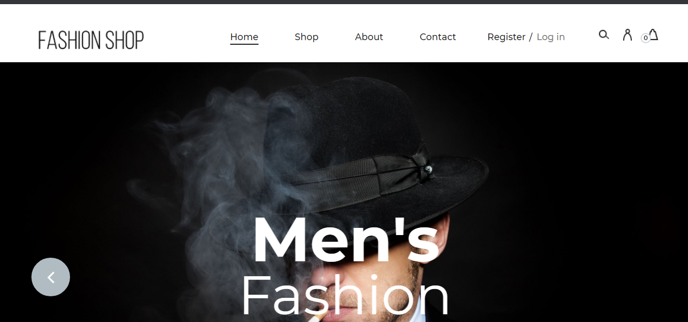
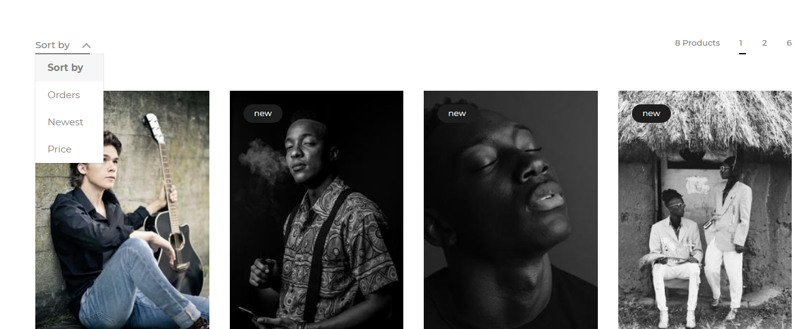
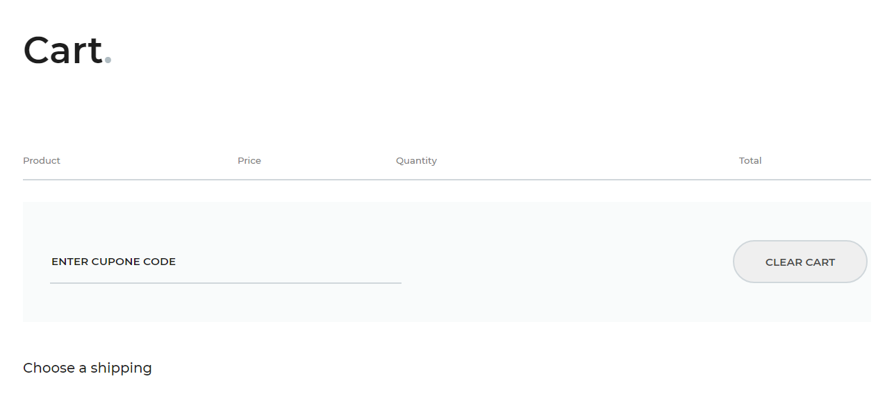
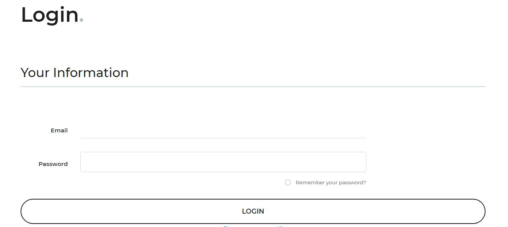
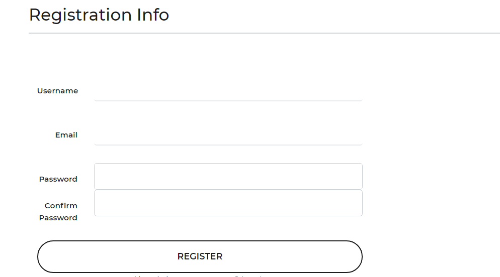
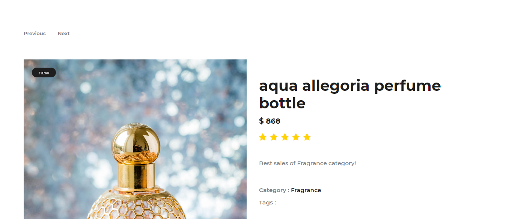
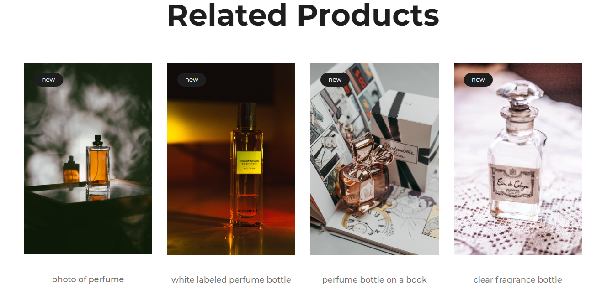

# FashionShopApp
Fashion Shop App is a e-commercial website project developing by me (academic purpose). The backend is written by Flask (Python) and The frontend used bootstrap. Moreover, there are also some A.I techniques that makes the project unique. This project is a suitable tutorial for self-taught beginner.
# Demo
<b>Link demo</b>: Coming soon.
 
<b>Screen Shot</b>: 

# Tech/Framework used
+ <b>Backend</b>: Flask
+ <b>Frontend</b>: Template & Bootstrap
+ <b>Search Function</b>: ElasticSearch
+ <b>Comment Section</b>: ChatterBot
+ <b>Related Products</b>: Recommemder System (Machine Learning)
